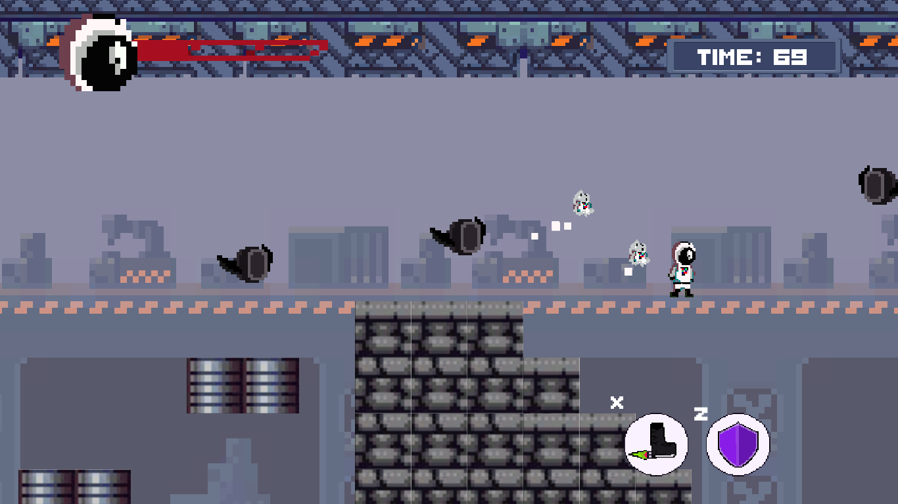
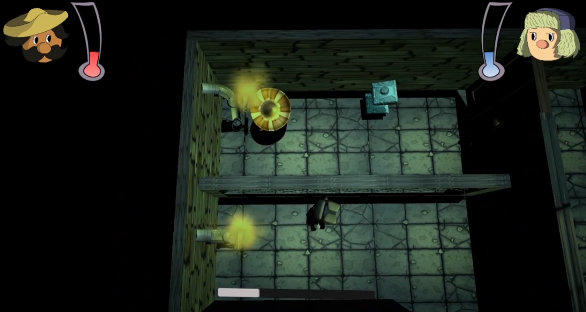
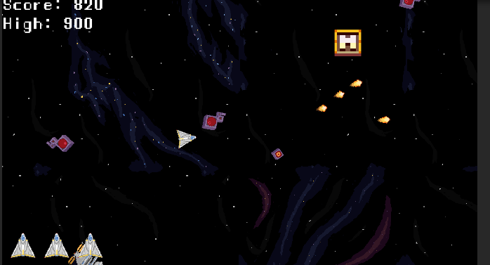

# Welcome to my portfolio!
Welcome! This is my portfolio containing all the games I've made as well as some features I have implemented as challenges.

## Space Loop 

* You can check [SpaceLoop](https://gamejolt.com/games/space-loop/431095) available on Game Jolt and it can be played on windows platforms. Made with Unity.

* Meet Apollo and discover his story while trying to develop a conspiracy due to a mysterious object that impacted his territory, but you must be very careful with the duality of the situation, some things are not what they seem. This level (videogame sample still in development) was done in 48 hours for the gameJam + 2019.

## Brain Drain

* You can check [BrainDrain](https://gamejolt.com/games/braindrain/467229) available on Game Jolt and it can be played on windows platforms. Made with Unity.

* The game is about two guys who are in trouble and need to repair leaks in the shortest possible time. The game has many features, however what is done is a demo for the Global Game Jam 2020.

## Survival Space Shooter

* You can check [Survival Space Shooter](https://solarius-prismus.itch.io/survival-space-shooter) available on Itch.io and it can be played on windows platforms as well as webGL. Made with Unity.

* The game was modified following Michigan State University Game Design and Development course.

## Mobile Rescue Game - In development

* This game will be released for mobile as is planned to have a virtual joystick. It's being made with Unity.
* The game is about a spaceship that must rescue the astronauts and take them to a mother ship. 